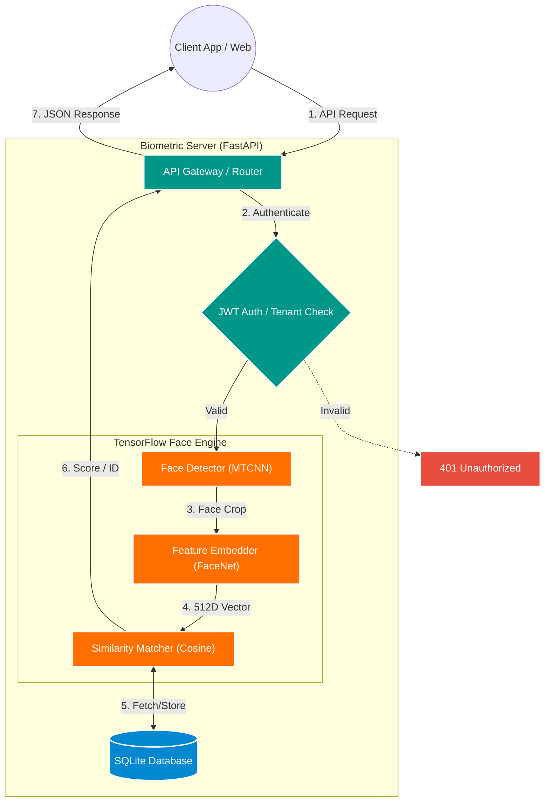
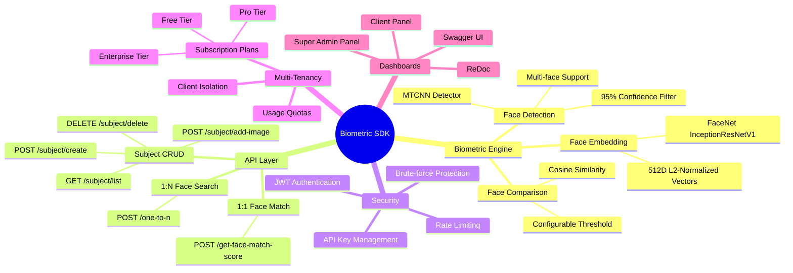

<p align="center">
  <h1 align="center">Biometric SDK</h1>
  <p align="center">
    <strong>Enterprise-Grade Face Biometric Recognition API</strong><br/>
    Powered by TensorFlow · MTCNN · FaceNet
  </p>
</p>

<p align="center">
  
  
  
  
  
</p>

<p align="center">
  <a href="#-quick-start--how-to-run">Quick Start</a> •
  <a href="#-api-documentation--swagger">API Docs</a> •
  <a href="#-key-features">Features</a> •
  <a href="#️-system-architecture--workflow">Architecture</a> •
  <a href="#-aws-deployment-guide-step-by-step">Deploy on AWS</a>
</p>

---

## 📖 Overview

**Biometric SDK v2.0** is a production-ready, subscription-based **Face Biometric Recognition API** built on top of **FastAPI** and **TensorFlow**. It enables developers to integrate advanced face biometric operations — such as **1:1 face verification**, **1:N face identification**, and **subject gallery management** — into any application via a simple REST API.

The SDK is designed for **multi-tenant** environments where each client receives isolated data storage, API keys, rate limits, and subscription-tier enforcement. It ships with built-in **Super Admin** and **Client** web dashboards for management, and auto-generated **Swagger** / **ReDoc** interactive API documentation.

### Who is it for?

| Use Case | Description |
|---|---|
| 🏢 **Enterprise Identity Systems** | Employee verification, access control, visitor management |
| 🏦 **FinTech / KYC** | Customer onboarding with face verification against ID documents |
| 📱 **Mobile Apps** | Face-based login, attendance tracking, user authentication |
| 🔒 **Security & Surveillance** | Watchlist matching across enrolled subjects |
| 🧪 **Research & Prototyping** | Rapid face recognition pipeline with a ready-made API |

---

## ✨ Key Features

### 🔬 Core Biometric Engine
| Feature | Description |
|---|---|
| **1:1 Face Matching** | Compare two base64-encoded face images and receive a similarity score with match/no-match verdict |
| **1:N Face Search** | Search a probe face against all enrolled subjects in your gallery — returns ranked results by similarity |
| **Face Detection** | MTCNN-powered multi-task cascaded detection with ≥95% confidence filtering |
| **Face Embedding** | 512-dimensional L2-normalized vectors generated by FaceNet (InceptionResNetV1 on VGGFace2) |
| **Cosine Similarity** | High-precision similarity scoring with configurable match threshold (default: 0.65) |

### 🏗️ Platform & Infrastructure
| Feature | Description |
|---|---|
| **Multi-Tenant Isolation** | Each client's subjects, embeddings, and usage are fully isolated via API key scoping |
| **Subscription Plans** | Built-in Free / Pro / Enterprise tiers with configurable rate limits, subject caps, and monthly quotas |
| **JWT Authentication** | Secure token-based auth for admin and client panel access |
| **API Key Auth** | Per-client API keys for programmatic SDK access with automatic rate limiting |
| **Rate Limiting** | SlowAPI-based per-minute rate limiting enforced per subscription tier |
| **Admin Dashboard** | Web-based Super Admin panel for managing clients, plans, API keys, and system metrics |
| **Client Dashboard** | Self-service client panel for testing APIs, viewing usage stats, and managing subjects |
| **Interactive API Docs** | Auto-generated Swagger UI and ReDoc documentation with try-it-out capabilities |

---

## 🛠️ Technology Stack

| Layer | Technology | Version | Purpose |
|---|---|---|---|
| **Framework** | [FastAPI](https://fastapi.tiangolo.com/) | 0.115.0 | High-performance async REST API framework |
| **ASGI Server** | [Uvicorn](https://www.uvicorn.org/) | 0.30.0 | Lightning-fast ASGI server |
| **ML Framework** | [TensorFlow](https://www.tensorflow.org/) | 2.16.1 | Deep learning model inference |
| **Face Detection** | [MTCNN](https://github.com/ipazc/mtcnn) | 1.0.0 | Multi-task Cascaded Convolutional Networks |
| **Face Embedding** | [Keras-FaceNet](https://github.com/nyoki-mtl/keras-facenet) | 0.3.2 | InceptionResNetV1 pretrained on VGGFace2 |
| **Validation** | [Pydantic](https://docs.pydantic.dev/) | 2.9.0 | Data validation & serialization |
| **Image Processing** | [Pillow](https://pillow.readthedocs.io/) | 10.4.0 | Image decoding & manipulation |
| **Numerical** | [NumPy](https://numpy.org/) | 1.26.4 | Array operations & vector math |
| **ML Utilities** | [scikit-learn](https://scikit-learn.org/) | 1.5.1 | Distance metrics & utilities |
| **Auth (JWT)** | [python-jose](https://github.com/mpdavis/python-jose) | 3.3.0 | JSON Web Token encoding/decoding |
| **Password Hashing** | [Passlib](https://passlib.readthedocs.io/) + bcrypt | 1.7.4 / 4.2.0 | Secure password hashing |
| **Rate Limiting** | [SlowAPI](https://github.com/laurentS/slowapi) | 0.1.9 | Request rate limiting per client |
| **Database** | SQLite | Built-in | Lightweight persistent storage |

---

## 🚀 Quick Start — How to Run

### Prerequisites

- **Python 3.8+** installed on your system
- **pip** package manager
- ~2 GB disk space (for TensorFlow model weights on first run)

### 1. Clone the Repository

```bash
git clone https://github.com/Mohammad007/face-biometric-sdk.git
cd face-biometric-sdk
```

### 2. Create & Activate Virtual Environment

```bash
# Create virtual environment
python -m venv venv

# Activate (Linux / macOS)
source venv/bin/activate

# Activate (Windows)
venv\Scripts\activate
```

### 3. Install Dependencies

```bash
pip install --upgrade pip
pip install -r requirements.txt
```

### 4. Configure Environment Variables

Create a `.env` file in the project root:

```env
HOST=0.0.0.0
PORT=8000
DATABASE_PATH=biometric_data.db
JWT_SECRET_KEY=your-secret-key-here
SUPER_ADMIN_EMAIL=admin@idssoft.com
SUPER_ADMIN_PASSWORD=Admin@123456
JWT_EXPIRY_HOURS=24
```

### 5. Start the Server

```bash
# Option A: Using Uvicorn directly
uvicorn app.main:app --reload --port 8000

# Option B: Using Python
python -m app.main
```

### 6. Open in Browser 🎉

| Resource | URL |
|---|---|
| 🏠 **Home** (redirects to Swagger) | [http://localhost:8000](http://localhost:8000) |
| 📘 **Swagger API Docs** | [http://localhost:8000/docs](http://localhost:8000/docs) |
| 📕 **ReDoc API Docs** | [http://localhost:8000/redoc](http://localhost:8000/redoc) |
| 🔑 **Super Admin Panel** | [http://localhost:8000/admin-panel](http://localhost:8000/admin-panel) |
| 👤 **Client Panel** | [http://localhost:8000/client-panel](http://localhost:8000/client-panel) |
| 💚 **Health Check** | [http://localhost:8000/health](http://localhost:8000/health) |

> **First Run Note:** On the very first startup, the server will automatically download the MTCNN and FaceNet model weights (~100 MB). Watch the console for `All models loaded!` before making API calls.

---

## 📘 API Documentation & Swagger

The SDK auto-generates interactive API documentation. Once the server is running, access the **Swagger UI** at `/docs` to explore and test all endpoints directly from your browser.

### API Endpoints Reference

#### 🔐 Authentication
All SDK endpoints require an **API Key** passed in the request header. Admin/client panels use **JWT tokens**.

#### 🟢 Face Match — `POST /get-face-match-score`
> **1:1 Face Verification** — Compare two face images and get a similarity score.

| Parameter | Type | Description |
|---|---|---|
| `image1` | `string (base64)` | First face image encoded in base64 (JPEG/PNG) |
| `image2` | `string (base64)` | Second face image encoded in base64 (JPEG/PNG) |

**Response:**
```json
{
  "similarity": 0.89,
  "matched": true,
  "threshold": 0.65,
  "message": "Faces match with 89.00% similarity"
}
```

#### 🔍 Face Search — `POST /one-to-n`
> **1:N Face Identification** — Search a probe face against all enrolled subjects.

| Parameter | Type | Description |
|---|---|---|
| `image` | `string (base64)` | Probe face image encoded in base64 |

**Response:**
```json
{
  "results": [
    {
      "subject_name": "John Doe",
      "similarity": 0.92,
      "matched": true
    }
  ],
  "total_subjects_searched": 150,
  "message": "Found 1 match(es). Best: 'John Doe' (92.00%)"
}
```

#### 👤 Subject Management

| Method | Endpoint | Description |
|---|---|---|
| `POST` | `/subject/create` | Register a new subject in your gallery |
| `POST` | `/subject/add-image` | Add a base64 face image to an existing subject |
| `GET` | `/subject/list` | List all subjects under your account |
| `DELETE` | `/subject/delete` | Delete a subject and all associated face data |

#### ❤️ Health Check — `GET /health`
```json
{
  "status": "healthy",
  "service": "Biometric SDK",
  "version": "2.0.0"
}
```

---

## 🏗️ System Architecture & Workflow

Below is the high-level operational workflow of the Biometric SDK. *(GitHub automatically renders this as an architecture diagram)*:



### SDK Feature Map



---

## 💰 Subscription Plans

The SDK ships with three built-in subscription tiers. Admins can customize these via the admin panel.

| Plan | Rate Limit | Max Subjects | Monthly Requests | Price |
|---|---|---|---|---|
| 🆓 **Free** | 10 req/min | 100 | 1,000 | $0.00 |
| ⚡ **Pro** | 100 req/min | 10,000 | 100,000 | $49.99 |
| 🏢 **Enterprise** | 1,000 req/min | 100,000 | 1,000,000 | $299.99 |

---

## 📁 Project Structure

```
face-biometric-sdk/
├── app/
│   ├── __init__.py            # Package init
│   ├── main.py                # FastAPI app entry point & router registration
│   ├── config.py              # Application settings & subscription plans
│   ├── database.py            # SQLite database layer (subjects, embeddings, clients)
│   ├── models.py              # Pydantic request/response models
│   ├── face_engine.py         # TensorFlow face detection, embedding & comparison
│   ├── auth.py                # API key verification & tenant scoping
│   ├── jwt_auth.py            # JWT token creation & validation
│   ├── security.py            # Password hashing & brute-force protection
│   ├── rate_limiter.py        # SlowAPI rate limiting configuration
│   └── routers/
│       ├── face_match.py      # POST /get-face-match-score (1:1)
│       ├── search.py          # POST /one-to-n (1:N)
│       ├── subjects.py        # Subject CRUD endpoints
│       ├── admin.py           # Super Admin API routes
│       └── client_panel.py    # Client panel API routes
├── static/
│   ├── admin.html             # Super Admin dashboard UI
│   └── client.html            # Client dashboard UI
├── requirements.txt           # Python dependencies
├── biometric_data.db          # SQLite database (auto-created)
└── README.md                  # This file
```

---

## ☁️ AWS Deployment Guide (Step-by-Step)

This guide will walk you through deploying the Biometric SDK to an **AWS EC2** instance using **Ubuntu** and **Nginx** (as a reverse proxy).

<details>
<summary><strong>📋 Click to expand the full deployment guide</strong></summary>

### Step 1: Launch an EC2 Instance
1. Log into your [AWS Management Console](https://console.aws.amazon.com/).
2. Navigate to **EC2** > **Launch Instances**.
3. **Name**: `biometric-sdk-server`
4. **AMI**: Select **Ubuntu Server 22.04 LTS (HVM)** or newer.
5. **Instance Type**: Select **t3.medium** or **t3.large** (TensorFlow requires at least 4GB of RAM for smooth embedding extraction).
6. **Key Pair**: Create or select an existing key pair (`.pem` format) to SSH into the instance.
7. **Network Settings**:
   - Check **Allow SSH traffic** (Port 22).
   - Check **Allow HTTP traffic** (Port 80).
   - Check **Allow HTTPS traffic** (Port 443).
8. **Storage**: Allocate at least **20GB - 30GB gp3** storage (Models and database will need space).
9. Click **Launch Instance**.

---

### Step 2: Connect to the Instance & System Setup
Open your terminal and SSH into your new EC2 instance:
```bash
ssh -i /path/to/your-key.pem ubuntu@<your-ec2-public-ip>
```

Update the package list and install necessary dependencies:
```bash
sudo apt update && sudo apt upgrade -y
sudo apt install python3-pip python3-venv nginx git unzip -y
```

---

### Step 3: Clone the Repository
```bash
cd /home/ubuntu
git clone https://github.com/Mohammad007/face-biometric-sdk.git biometric_server
cd biometric_server
```

---

### Step 4: Setup Python Virtual Environment
```bash
python3 -m venv venv
source venv/bin/activate
pip install --upgrade pip
pip install -r requirements.txt
```

---

### Step 5: Configure the Environment Variables
```bash
nano .env
```
```env
HOST=127.0.0.1
PORT=8000
DATABASE_PATH=biometric_data.db
JWT_SECRET_KEY=generate-a-very-long-random-secret-key-here
SUPER_ADMIN_EMAIL=admin@idssoft.com
SUPER_ADMIN_PASSWORD=Admin@123456
JWT_EXPIRY_HOURS=24
```
*(Save and exit nano: `CTRL+O`, `Enter`, `CTRL+X`)*

---

### Step 6: Create Systemd Service for FastAPI (Uvicorn)
```bash
sudo nano /etc/systemd/system/biometric.service
```

```ini
[Unit]
Description=Biometric API Service
After=network.target

[Service]
User=ubuntu
Group=www-data
WorkingDirectory=/home/ubuntu/biometric_server
Environment="PATH=/home/ubuntu/biometric_server/venv/bin"
ExecStart=/home/ubuntu/biometric_server/venv/bin/uvicorn app.main:app --host 127.0.0.1 --port 8000 --workers 4

[Install]
WantedBy=multi-user.target
```

Start and enable:
```bash
sudo systemctl daemon-reload
sudo systemctl start biometric
sudo systemctl enable biometric
sudo systemctl status biometric
```

---

### Step 7: Configure Nginx as a Reverse Proxy
```bash
sudo nano /etc/nginx/sites-available/biometric.conf
```

```nginx
server {
    listen 80;
    server_name your-domain.com <your-ec2-public-ip>;

    location / {
        proxy_pass http://127.0.0.1:8000;
        proxy_set_header Host $host;
        proxy_set_header X-Real-IP $remote_addr;
        proxy_set_header X-Forwarded-For $proxy_add_x_forwarded_for;
        proxy_set_header X-Forwarded-Proto $scheme;
    }
}
```

```bash
sudo ln -s /etc/nginx/sites-available/biometric.conf /etc/nginx/sites-enabled/
sudo rm /etc/nginx/sites-enabled/default
sudo nginx -t
sudo systemctl restart nginx
```

---

### Step 8: Initial Server Boot
Monitor logs to confirm model downloads complete:
```bash
journalctl -u biometric.service -f
```
Wait for: `INFO: All models loaded!` and `INFO: Application startup complete.`

---

### Step 9: Securing with SSL/HTTPS (Recommended)
```bash
sudo apt install certbot python3-certbot-nginx -y
sudo certbot --nginx -d your-domain.com
```

</details>

---

## 🎉 Production Endpoints

Once deployed, your SDK is accessible at:

| Resource | URL |
|---|---|
| 📘 **Swagger API Docs** | `http://<your-ip-or-domain>/docs` |
| 📕 **ReDoc API Docs** | `http://<your-ip-or-domain>/redoc` |
| 🔑 **Super Admin Dashboard** | `http://<your-ip-or-domain>/admin-panel` |
| 👤 **Client Dashboard** | `http://<your-ip-or-domain>/client-panel` |
| 💚 **Health Check** | `http://<your-ip-or-domain>/health` |
| 📄 **OpenAPI JSON** | `http://<your-ip-or-domain>/openapi.json` |

### Default Admin Credentials
| Field | Value |
|---|---|
| **Email** | `admin@idssoft.com` |
| **Password** | `Admin@123456` |

> ⚠️ **Security Warning:** Change the default credentials immediately after your first login in production.

---

## 📄 License

This project is **proprietary software** by **Mohammad007**. All rights reserved.

---

<p align="center">
  Made with ❤️ by <strong>Mohammad007</strong><br/>
  <a href="https://github.com/Mohammad007/face-biometric-sdk">⭐ Star this repo</a> if you find it useful!
</p>
