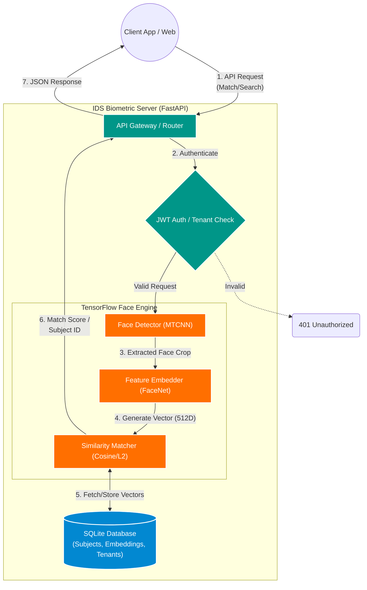

# 🆔 IDS Soft Biometric SDK


Advanced Face Biometric Recognition API powered by **TensorFlow**. This robust endpoint provides highly accurate 1:1 face matching, large-scale 1:N face search operations, comprehensive subject management, and subscription-based multi-tenant access control for seamless integration into various ecosystems.

---

## ✨ Core Features
*   **1:1 Face Matching:** Compare two explicitly provided face images to determine if they match.
*   **1:N Face Search:** Rapidly scan an entire database to identify an ingested face out of `N` enrolled subjects.
*   **Subject Management:** Create, update, and manage subjects, identities, and enrolled embedding representations.
*   **Multi-Tenant Architecture:** Subscription and tier-based API access segmentation secured by JWT Authentication.
*   **Deep Learning Pipeline:** Utilizes state-of-the-art `MTCNN` for reliable face detection and alignment, alongside `FaceNet` for robust feature embedding generation.
*   **Web Dashboards:** Integrated Super Admin and Client panels for easy metrics observation and configuration.

---

## 🏗️ System Architecture & Workflow

Below is the high-level operational workflow of the IDS Soft Biometric SDK. *(GitHub automatically renders this diagram as an architecture image)*:



---

## 🚀 AWS Deployment Guide (Step-by-Step)

This guide will walk you through deploying the IDS Soft Biometric SDK to an **AWS EC2** instance using **Ubuntu**, **Docker**, and **Nginx** (as a reverse proxy).

### Step 1: Launch an EC2 Instance
1. Log into your [AWS Management Console](https://console.aws.amazon.com/).
2. Navigate to **EC2** > **Launch Instances**.
3. **Name**: `biometric-sdk-server`
4. **AMI**: Select **Ubuntu Server 22.04 LTS (HVM)** or newer.
5. **Instance Type**: Select **t3.medium** or **t3.large** (TensorFlow requires at least 4GB of RAM for smooth embedding extraction).
6. **Key Pair**: Create or select an existing key pair (`.pem` format) to SSH into the instance.
7. **Network Settings**:
   - Check **Allow SSH traffic** (Port 22).
   - Check **Allow HTTP traffic** (Port 80).
   - Check **Allow HTTPS traffic** (Port 443).
8. **Storage**: Allocate at least **20GB - 30GB gp3** storage (Models and database will need space).
9. Click **Launch Instance**.

---

### Step 2: Connect to the Instance & System Setup
Open your terminal and SSH into your new EC2 instance:
```bash
ssh -i /path/to/your-key.pem ubuntu@<your-ec2-public-ip>
```

Update the package list and install necessary dependencies:
```bash
sudo apt update && sudo apt upgrade -y
sudo apt install python3-pip python3-venv nginx git unzip -y
```

---

### Step 3: Clone the Repository
Clone your code to the server. (If your repository is private, you can upload via SCP, GitHub deployment keys, or clone directly).
```bash
cd /home/ubuntu
git clone <your-repository-url> biometric_server
cd biometric_server
```

---

### Step 4: Setup Python Virtual Environment
We recommend running the application inside an isolated virtual environment.

```bash
# Create the virtual environment
python3 -m venv venv

# Activate the virtual environment
source venv/bin/activate

# Install all required Python packages
pip install --upgrade pip
pip install -r requirements.txt
```

---

### Step 5: Configure the Environment Variables
Set up the required configuration for production use.
```bash
nano .env
```
Paste in the following configurations (Change the keys/passwords securely!):
```env
HOST=127.0.0.1
PORT=8000
DATABASE_PATH=biometric_data.db
JWT_SECRET_KEY=generate-a-very-long-random-secret-key-here
SUPER_ADMIN_EMAIL=admin@idssoft.com
SUPER_ADMIN_PASSWORD=Admin@123456
JWT_EXPIRY_HOURS=24
```
*(Save and exit nano: `CTRL+O`, `Enter`, `CTRL+X`)*

---

### Step 6: Create Systemd Service for FastAPI (Uvicorn)
To ensure the backend stays online natively and restarts automatically if the server reboots, configure a `systemd` service.

```bash
sudo nano /etc/systemd/system/biometric.service
```

Add the following (assuming your code is in `/home/ubuntu/biometric_server`):
```ini
[Unit]
Description=Gunicorn instance to serve IDS Soft Biometric API
After=network.target

[Service]
User=ubuntu
Group=www-data
WorkingDirectory=/home/ubuntu/biometric_server
Environment="PATH=/home/ubuntu/biometric_server/venv/bin"
ExecStart=/home/ubuntu/biometric_server/venv/bin/uvicorn app.main:app --host 127.0.0.1 --port 8000 --workers 4

[Install]
WantedBy=multi-user.target
```

Start and enable the service:
```bash
sudo systemctl daemon-reload
sudo systemctl start biometric
sudo systemctl enable biometric
```
You can check if the app is successfully running with: `sudo systemctl status biometric`

---

### Step 7: Configure Nginx as a Reverse Proxy
Now we will use Nginx to map port 80 (HTTP) to your uvicorn server running on internal port 8000.

Create a new Nginx configuration block:
```bash
sudo nano /etc/nginx/sites-available/biometric.conf
```

Paste the following config (Replace `your-domain.com` with your actual Domain or Elastic IP):
```nginx
server {
    listen 80;
    server_name your-domain.com <your-ec2-public-ip>;

    location / {
        proxy_pass http://127.0.0.1:8000;
        proxy_set_header Host $host;
        proxy_set_header X-Real-IP $remote_addr;
        proxy_set_header X-Forwarded-For $proxy_add_x_forwarded_for;
        proxy_set_header X-Forwarded-Proto $scheme;
    }
}
```

Enable the configuration and restart Nginx:
```bash
sudo ln -s /etc/nginx/sites-available/biometric.conf /etc/nginx/sites-enabled/
sudo rm /etc/nginx/sites-enabled/default
sudo nginx -t
sudo systemctl restart nginx
```

---

### Step 8: Initial Server Boot (Downloading the Models)
Since TensorFlow MTCNN and FaceNet need to retrieve the Deep Learning weights from the internet on the very first boot, monitor your system logs to see when the startup finishes:
```bash
journalctl -u biometric.service -f
```
Wait to see: `INFO: All models loaded!` and `INFO: Application startup complete.`

---

### Step 9: Securing with SSL/HTTPS (Optional but HIGHLY Recommended)
If you pointed a domain name to your EC2 instance, you can automatically install a free SSL certificate using Certbot.
```bash
sudo apt install certbot python3-certbot-nginx -y
sudo certbot --nginx -d your-domain.com
```

---

## 🎉 Deployment Finished!

Your Biometric SDK is now live.

### Endpoints
* **Swagger API Docs**: `http://<your-ip-or-domain>/docs`
* **Super Admin Dashboard**: `http://<your-ip-or-domain>/admin-panel`
* **Client Dashboard**: `http://<your-ip-or-domain>/client-panel`

### Initial Admin Login
- **Email:** admin@idssoft.com
- **Password:** Admin@123456
  
*(It is strongly recommended to log in and change these default credentials immediately in production).*
